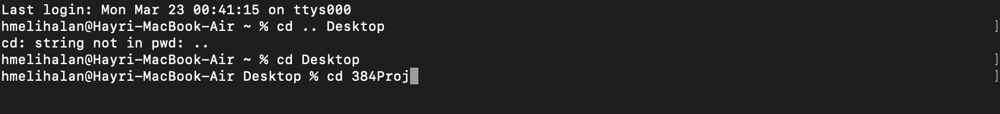
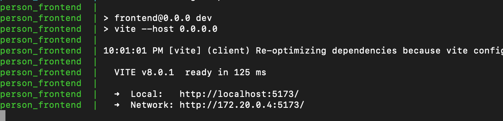
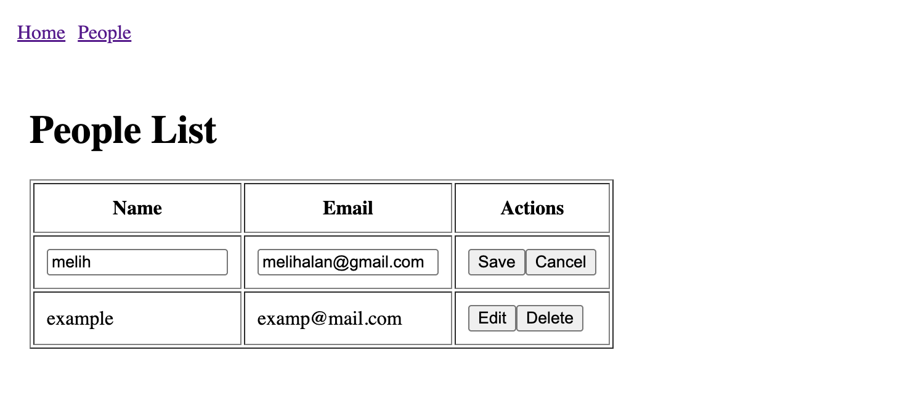

## How to Run

Make sure Docker is installed and running on your system.

Then run:


```bash
docker compose up --build
```

After the services are started, open your browser and go to:


On UI You can add people to the database using add person:


You can edit/delete people on people page by clicking the options:

Notes
	•	The application runs entirely with Docker Compose.
	•	The database is automatically initialized on startup.
	•	All services (frontend, backend, database) are started with a single command.

	
